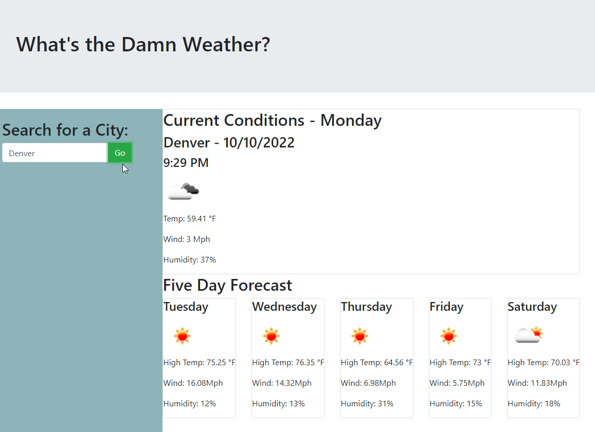

# 06 - Whats The Damn Weather?
# Submitted by Conor Donnelly - October 10, 2022

This challenge required us to write code from scratch to build a weather forecast dashboard using free data from two different APIs provided by OpenWeatherMaps. 

1st) A user enters a city name into a search form. After clicking the "Go" button the city name is passed to the Geocoding API that converts a matching city name into Lat/Lon coordinated.

2nd) The Lat/Lon coordinates are passed to another API in order to get back JSON data that can be parsed into an object and those data elements are used throught the page to populate data elements.

I relied on the moment.js library to work with date/time variables and in order to convert formatting from UNIX dates to standard MM/DD/YYY.

Bootstrap framework made it easy to apply some default table structure to the task grid.

I would like to keep building some additional features of the page, like saving the search history, and loading the page by default using the last searched city. 

## Page URL
(https://riversidempls.github.io/06-WeatherFinder/)

## Screenshot

